# Types of Databases
- Hierarchical databases
- Network databases
- Object-oriented databases
- Relational databases
- NoSQL databases

# SQL
SQL is a programming language

• Manage data held in a relational database
• Easy to learn
• Very powerful
• 1974
• Used all over the internet
# How data is stored
### Stores data in tables
- Columns
- Rows

# TABLE
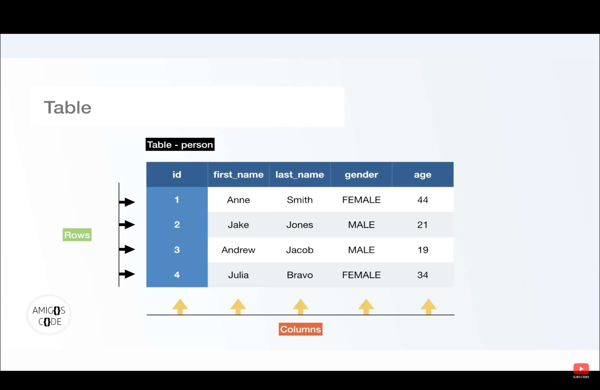
# Relational database


# sql language types
- TCL (Transaction Control Language)
- DML (Data Manipulation Language)
- DCL (Data Control Language)
- DDL (Data Definition Language)

# SQL COMMAND 

### LIST OF ALL DATA BASE 
- `\l`

### CREATE DATA BASE
````
    CREATE DATABASE database_name;
````
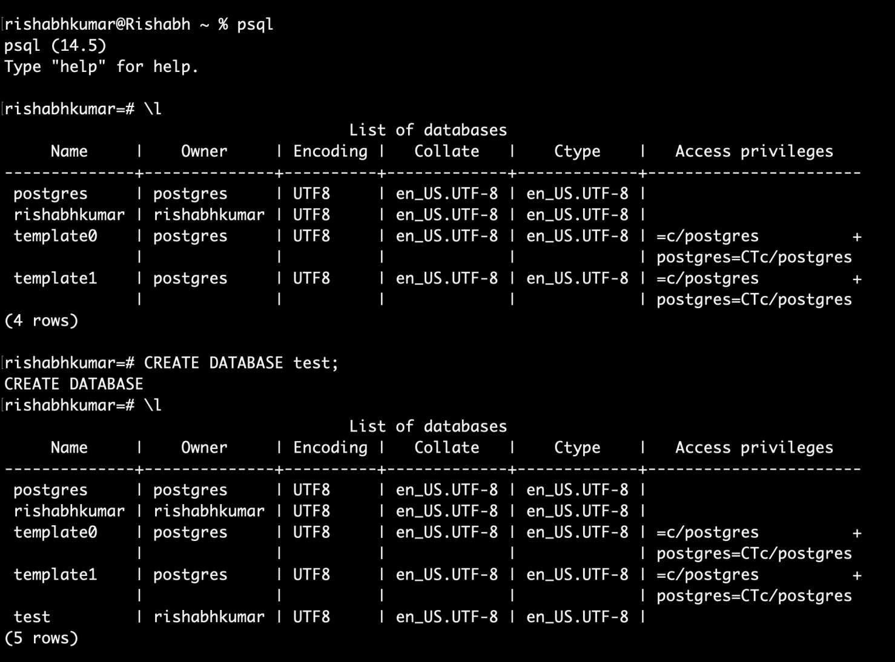

## Change Data base 
````
    \c database_name
````
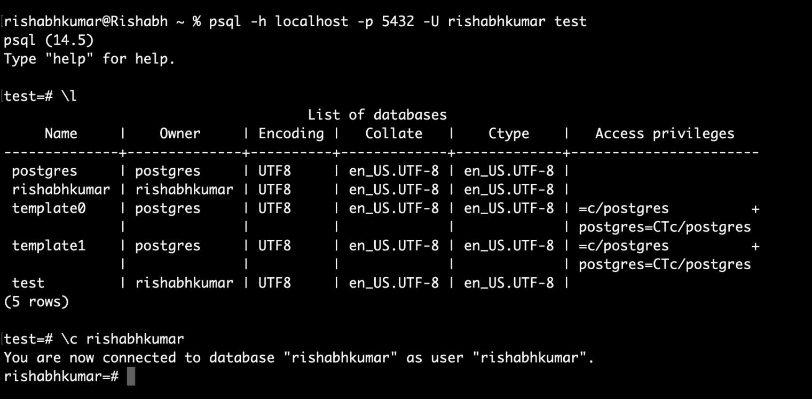

# How to create table with Postgres 

### CREATE TABLE WITHOUT CONSTRAINTS
````
CREATE TABLE table name (
Column name + data type + constraints if any
)

CREATE TABLE person (
id int, 
first_name VARCHAR (50), 
last_name VARCHAR (50), 
gender VARCHAR (6),
date of birth TIMESTAMP,
)
````
## show all table in database 
````
\d 
````
## show perticular table 
````
\d table_name   // it show all info about table
````
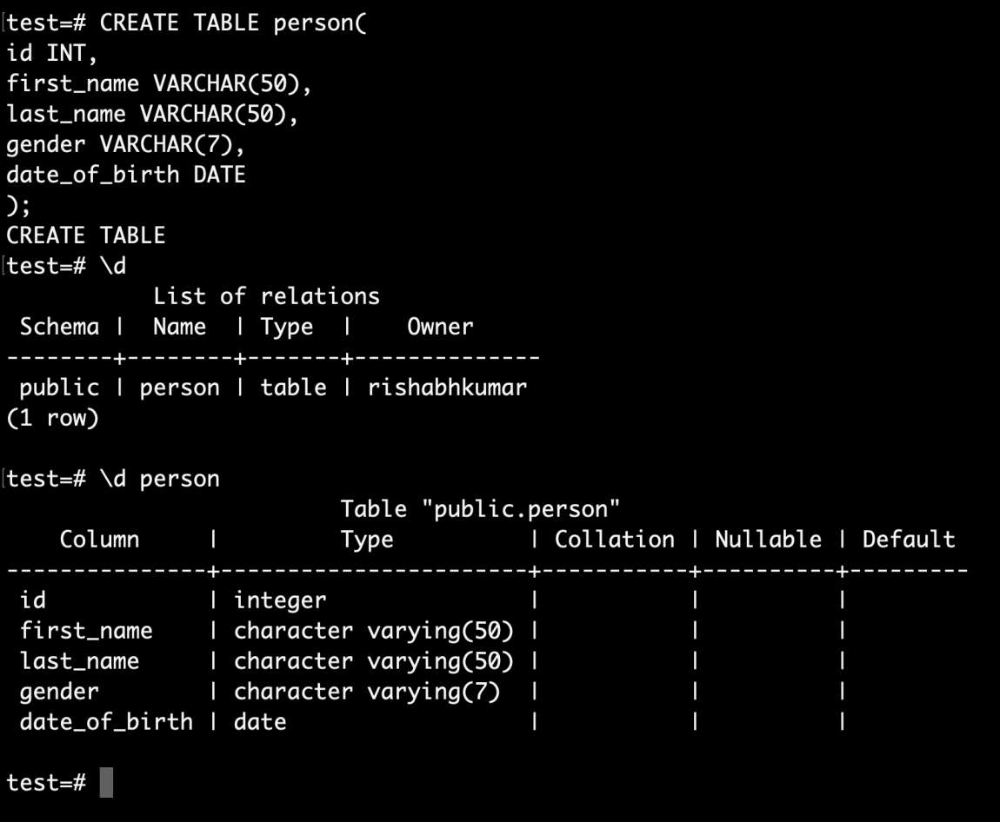

# How to Delete table in databases 
````
    DROP TABLE table_name;
````
# CREATE TABLE WITH CONSTRAINTS
````
CREATE TABLE person (
id BIGSERIAL NOT NULL PRIMARY KEY, 
first name VARCHAR (50) NOT NULL, 
last name VARCHAR (50) NOT NULL, 
gender VARCHAR (5) NOT NULL, 
date of birth DATE NOT NULL,
)
````
# INSERT DATA
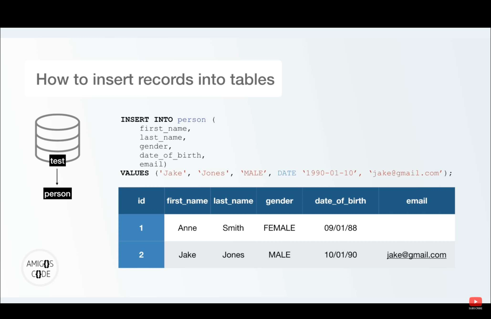
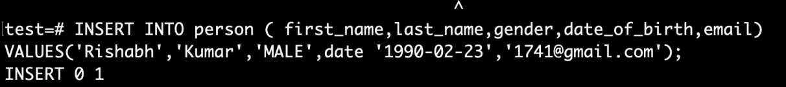
# READ DATA FROM THE TABLE
````
        SELECT * FROM table_name;
        SELECT COLUMN_NAME FROM table_name;
````

# SORTING 
 ````
 SELECT * FROM person ORDER BY country_of_birth;
 SELECT * FROM person ORDER BY country_of_birth ASC ;
 SELECT * FROM person ORDER BY country_of_birth DESC ;
 ````
# REMOVING DUPLICATES
DISTINCT TAKE 1 COLUMN NAME
````
SELECT DISTINCT country_of_birth FROM person ORDER BY country_of_birth;
````
# WHERE CLAUSE
````
 SELECT * FROM person
 WHERE gender='Male';

 SELECT * FROM person
 WHERE gender='Male' AND country_of_birth='Poland';
````
# COMPARISON OPERATORS

# LIMIT OFFSET AND FETCH
````
SELECT * FROM person LIMIT 10;                 //DISPLAY UPPER 10 ROW 
SELECT * FROM person OFFSET 5 LIMIT 10;        // DISPLAY  UPPER 10 ROW AFTER 5 ROW

SELECT * FROM person OFFSET 5 FETCH FIRST 5 ROW ONLY;
````
# IN KEYWORD
````
===> BAD WAY 

SELECT * FROM person WHERE country_ôf_birth = 'China'
OR country_of_birth = 'France' OR country_of_birth = 'Brazil'

===> GOOD WAY

SELECT * test-# FROM person
WHERE country_of_birth IN ('China', 'Brazil', 'France")
````
# BETWEEN
````
SELECT * FROM person 
WHERE id BETWEEN 1 AND 10;

SELECT * FROM person
WHERE date_of_birth BETWEEN DATE '2022-01-01' AND '2022-11-22';
````

# LIKE
% is called wild card 
_ dash compared with single character
````
SELECT * FROM person WHERE email LIKE '%.com';

SELECT * FROM person
WHERE email LIKE '%@facebook%';

SELECT * FROM person 
WHERE email LIKE '_______%';
````
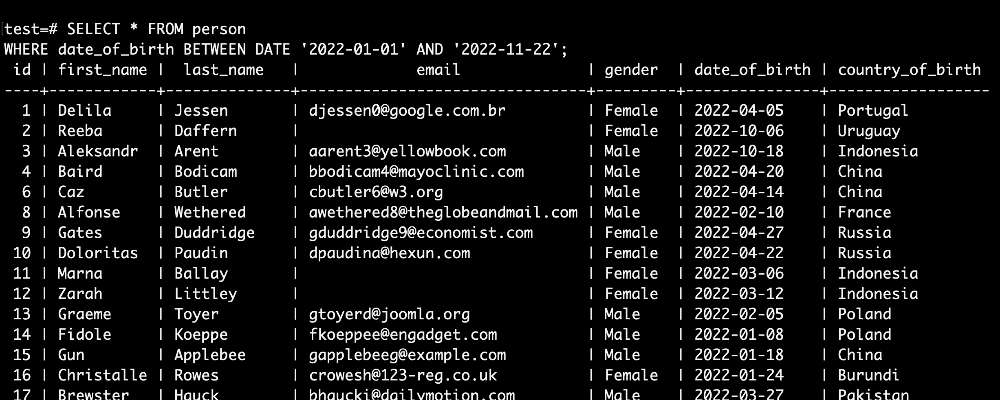

# GROUP BY
````
SELECT country_of_birth,COUNT(country_of_birth) FROM person GROUP BY country_of_birth;
````
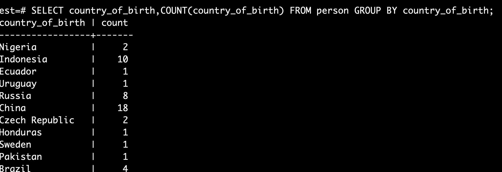
# HAVING 
- Having work with group by  
- having is used for adding extra condition/filtering
````
SELECT country_of_birth,COUNT(country_of_birth) FROM person GROUP BY country_of_birth HAVING count(*) >5 ;
````
# Aggregate Functions
An aggregate function performs a calculation on a set of values, and returns a single value. Except for COUNT(*) , aggregate functions ignore null values. Aggregate functions are often used with the GROUP BY clause of the SELECT statement. All aggregate functions are deterministic

##  MAX()/MIN()/AVG()/ROUND()
````
SELECT MAX(price) FROM car;
SELECT MIN(price) FROM car;
SELECT AVG(price) FROM car;
SELECT ROUND(AVG(price)) FROM car;
SELECT make,MAX(price) FROM car GROUP BY make LIMIT 5;
````
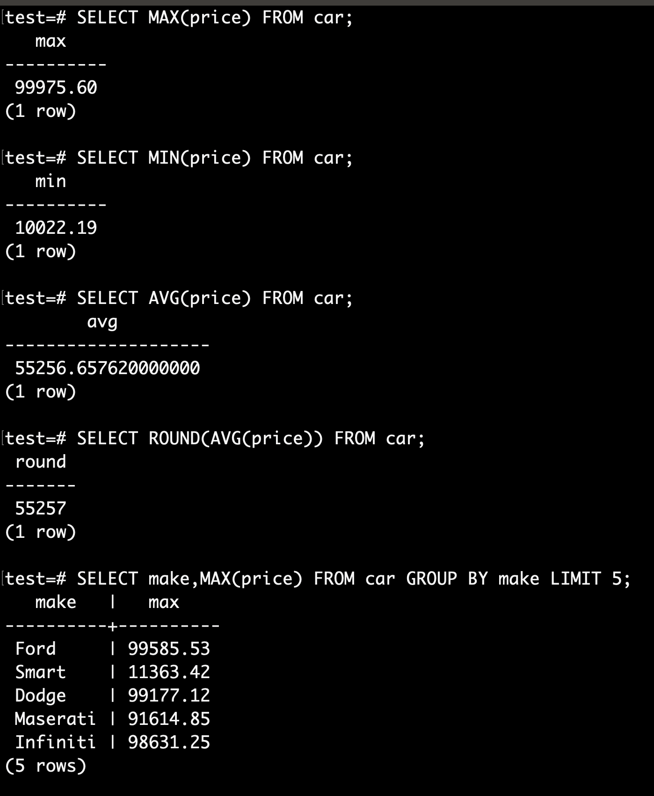

## SUM()
````
SELECT SUM(price) from car;
````
# ARITHMETIC OPERATORS
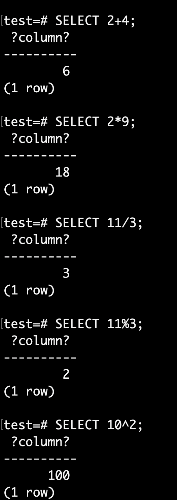

## WORKING WITH ARITHMETIC OPERATORS
````
SELECT id, make, model, price, ROUND(price * •10, 2), ROUND(price - (price *• 10),2 FROM car;
````
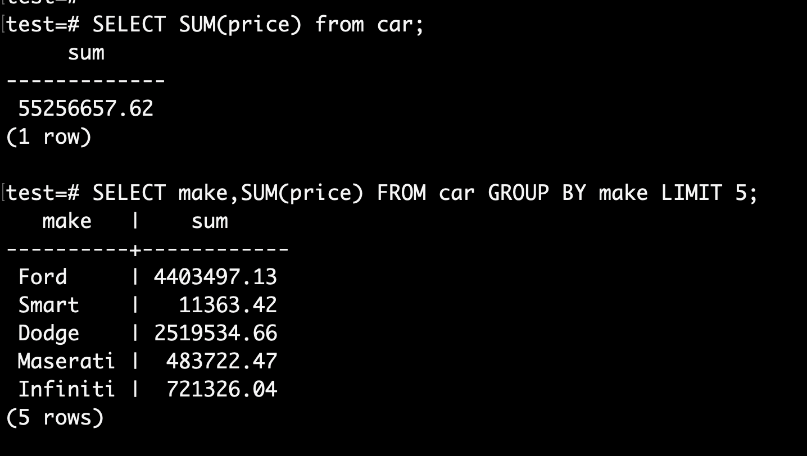

# ALIAS
````
SELECT id,make,model,price, ROUND((price * .10)) AS PRICE_OF_CAR  from car;
````
# COALESCE
````
SELECT COALESCE(email,'email not present') from person;
````
# NOW()
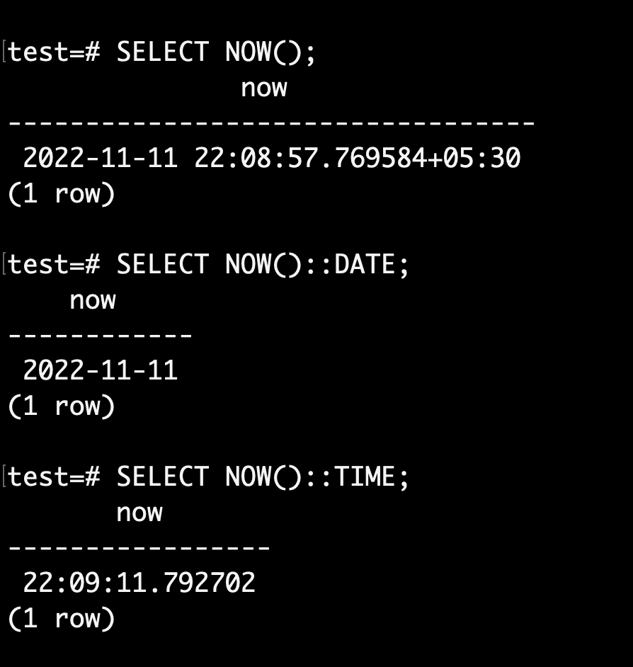

# PRIMARY KEY
### Drop primary key
````
ALTER TABLE person DROP CONSTRAINT person_pkey;
````

# ADDING PK CONSTRAINTS
````
Alter TABLE person ADD PRIMARY KEY (id);
````
# UNIQUE CONSTRAINTS
````
ALTER TABLE person ADD CONSTRAINT unique_email_id UNIQUE(email);

ALTER TABLE person ADD UNIQUE (email);
````
# DROP CONSTRAINTS 
````
ALTER TABLE person DROP CONSTRAINT unique_email_id;
````
# CHECK CONSTRAINS
````
SELECT DISTINCT gender FROM person;

ALTER TABLE person ADD CONSTRAINT gender_contraint CHECK (gender = 'Female' OR gender = 'Male');
````
# delete row in table
````
DELETE FROM person where id=1;
DELETE FROM person WHERE gender = 'Male'

````
# UPDATING RECORDS
````
UPDATE person SET email = "ommar@gmail.com' WHERE id = 2011;

UPDATE person SET first_name = 'Omar' , last_name = 'Montana', email = "omar . montana@hotmail.com' WHERE id = 2011;
````
# FOREIGN KEYS RELATIONSHIPS


