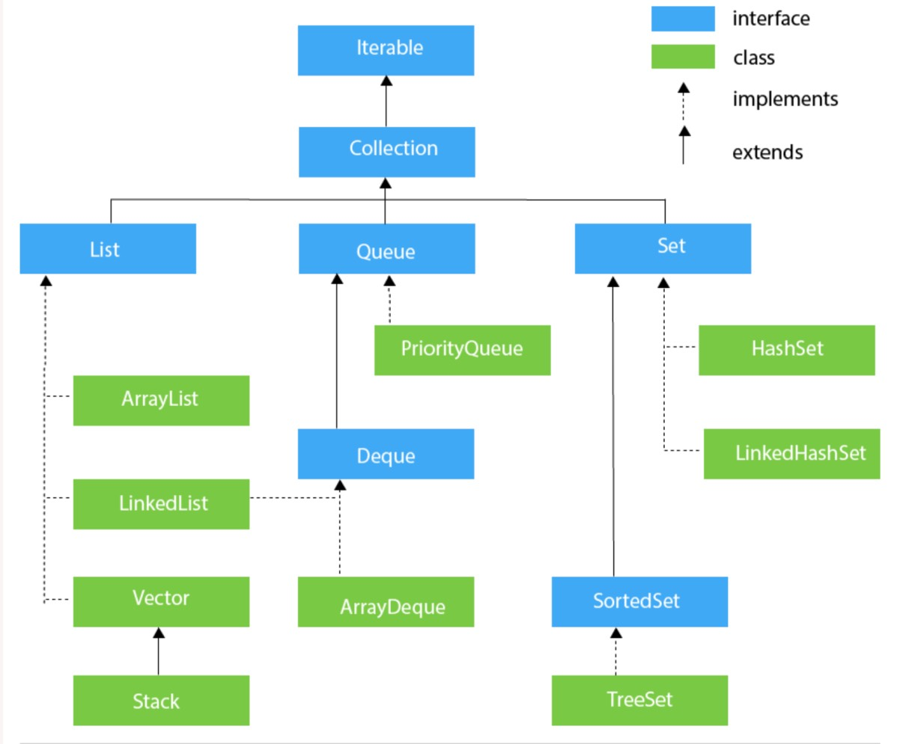

## Collections in Java
Java Collections can achieve all the operations that you perform on a data such as searching, sorting, insertion, manipulation, and deletion.

## What is Collection framework

The Collection framework represents a unified architecture for storing and manipulating a group of objects. It has:

- Interfaces and its implementations, i.e., classes
- Algorithm

````
1 What are the two ways to iterate the elements of a collection?
2 What is the difference between ArrayList and LinkedList classes in collection framework?
3 What is the difference between ArrayList and Vector classes in collection framework?
4 What is the difference between HashSet and HashMap classes in collection framework?
5 What is the difference between HashMap and Hashtable class?
6 What is the difference between Iterator and Enumeration interface in collection framework?
7 How can we sort the elements of an object? What is the difference between Comparable and Comparator interfaces?
8 What does the hashcode() method?
9 What is the difference between Java collection and Java collections?
````
## Hierarchy of Collection Framework


## Java ArrayList
Java ArrayList class uses a dynamic array
for storing the elements. It is like an array, but there is no size limit. We can add or remove elements anytime. So, it is much more flexible than the traditional array. It is found in the java.util package.


